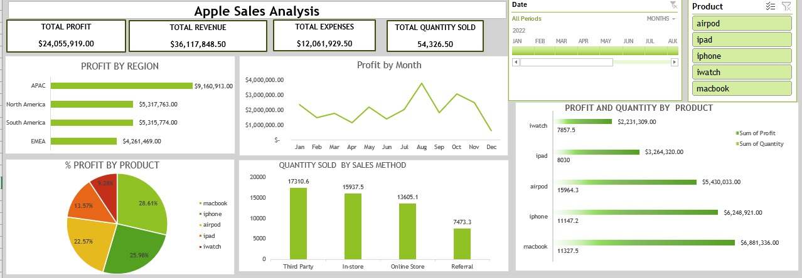
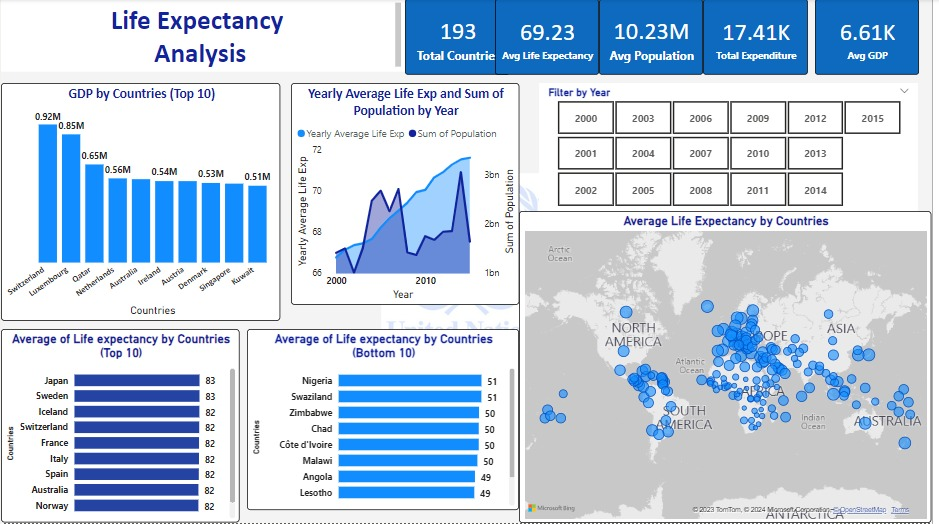

## Oladayo Ojekunle Data Analytics Portfolio
# Project 1

**Title:** [Apple Sales Analysis | January 2022-December 2022](https://github.com/dayodata/Data_Analytics/tree/main)

**Description:** This project is about the analysis of Apple company sales for the entire year 2022. The project shows the the profit made across different rigions across the world.

# Project 2

**Title:** [Life Expectancy Analysis | 2000/2015](https://github.com/dayodata/Data_Analytics/tree/main)

**Description:** This project focused on the life expectancy of people across the globe. The analysis included 193 countries across the globe. The outcome of the analysis shows that the average life expectancy of people across the globe is 69 years.

